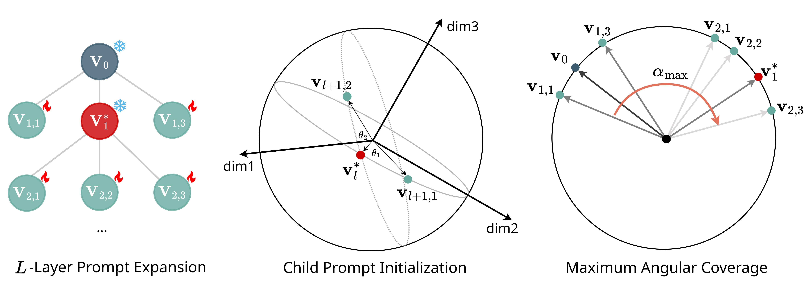

# DiPEx

This repository provides the official PyTorch implementation of our paper, [**DiPEx: Dispersing Prompt Expansion for Class-Agnostic Object Detection**](https://openreview.net/pdf?id=NDs9Ejz4Pe), presented at [**NeurIPS 2024**](https://nips.cc/virtual/2024/poster/95458).

<div align="center">
  
</div>

## **Overview**
Class-agnostic object detection often struggles to maintain high recall rates due to the diversity of object types and their contextual complexity. To address this challenge, we introduce Dispersing Prompt Expansion (DiPEx), a self-supervised method that leverages vision-language models. DiPEx begins by training generic parent prompts, then expands the prompt with the highest semantic uncertainty into child prompts that capture finer, non-overlapping meanings while inheriting the parent's semantics. Dispersion losses ensure high inter-class discrepancy among the child prompts while preserving consistency with the parent, and the maximum angular coverage (MAC) criterion prevents over-expansion. Experimental results demonstrate that DiPEx achieves broader, more comprehensive semantic coverage, ultimately enhancing the robustness of object detection across both in-distribution and out-of-distribution scenarios.

<div align="center">
  
</div>

---

## Table of Contents
- [Installation](#installation)
  - [Requirements](#requirements)
  - [Install Open-GroundingDino](#install-open-groundingdino)
- [Getting Started](#getting-started)
  - [Dataset Preparation](#dataset-preparation)
  - [Training & Testing](#training--testing)

---

## Installation

### Requirements
Our development and testing environment includes:
- Python 3.10+
- PyTorch 2.4.0
- CUDA 12.1

### Install Open-GroundingDino
DiPEx is built on top of [Open-GroundingDino](https://github.com/longzw1997/Open-GroundingDino).   Please follow their [installation guide](https://github.com/longzw1997/Open-GroundingDino#installation) before proceeding.

---

## Getting Started

### Dataset Preparation
This repository currently supports the **COCO** and **LVIS** datasets, with plans to add more in the near future. For detailed instructions on downloading, organizing, and preparing these datasets, refer to the [Open-GroundingDino documentation](https://github.com/longzw1997/Open-GroundingDino).

### Training & Testing

#### Training
To train DiPEx as outlined in the paper, navigate to the `Open-GroundingDino` directory and run:
```bash
bash train_dipex.sh
```

#### Testing
For class-agnostic object detection evaluation, ensure that all class labels in the ground truth annotations are set to `1` (e.g., `category_id` field in COCO). Then, to evaluate the trained DiPEx model, simply run:
```bash
bash test_dipex.sh
```

---

## Acknowledgement
We extend our gratitude to the developers of [Open-GroundingDino](https://github.com/longzw1997/Open-GroundingDino) for their outstanding codebase, on which this work is built.